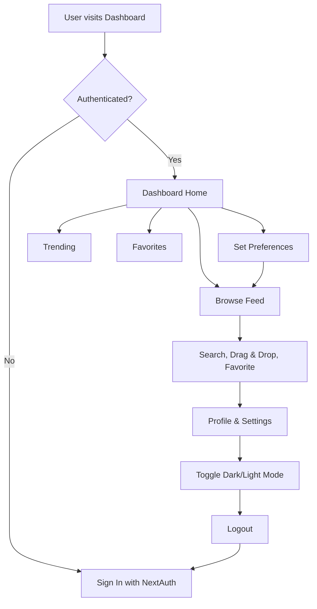

# Personalized Content Dashboard


A modern, full-stack dashboard that delivers personalized news, movies, and social content feeds. Built with Next.js, TypeScript, Redux Toolkit, and Tailwind CSS, it features authentication, user preferences, dark mode, and robust error handling.

---

## 📚 Table of Contents

- [Features](#-features)
- [Tech Stack](#-tech-stack)
- [Quick Start](#-quick-start)
- [API Key Management](#-api-key-management)
- [User Flow](#-user-flow)
- [Testing](#-testing)
- [Project Structure](#-project-structure)
- [Customization](#-customization)
- [Troubleshooting](#-troubleshooting)
- [Contributing](#-contributing)
- [License](#-license)
- [Support & Contact](#-support--contact)

---

## 🚀 Features

- **Personalized Feed**: Unified dashboard for news, movies, and social posts based on user-selected categories
- **Authentication**: Secure sign-in with NextAuth.js and MongoDB adapter
- **User Preferences**: Select and save favorite content categories
- **Favorites**: Mark and manage favorite items, persisted across sessions
- **Infinite Scroll**: Seamless content loading as you scroll
- **Drag & Drop**: Reorder content cards in your feed
- **Search**: Debounced search across all content types
- **Dark Mode**: Toggle and persist light/dark themes
- **Responsive Design**: Optimized for all devices
- **Error Handling**: Graceful fallbacks and clear user feedback
- **Testing**: Unit and integration tests for reliability

---

## 🛠 Tech Stack

- **Frontend**: Next.js (App Router), React, TypeScript, Tailwind CSS
- **State Management**: Redux Toolkit, RTK Query, redux-persist
- **Authentication**: NextAuth.js, MongoDB Adapter
- **APIs**: NewsAPI, TMDB, Mock Social API
- **Testing**: React Testing Library, Jest

---

## ⚡️ Quick Start

### Prerequisites
- Node.js v18+
- npm or yarn
- MongoDB instance (for authentication)

### 1. Clone the Repository
```bash
git clone https://github.com/Riyak05/personalized-content-dashboard.git
cd personalized-content-dashboard
```

### 2. Install Dependencies
```bash
npm install
# or
yarn install
```

### 3. Configure Environment Variables
Create a `.env` file in the root directory:
```env
# News API (https://newsapi.org/)
NEXT_PUBLIC_NEWS_API_KEY=your_news_api_key

# TMDB API (https://www.themoviedb.org/)
NEXT_PUBLIC_TMDB_API_KEY=your_tmdb_api_key

# NextAuth.js (https://next-auth.js.org/)
NEXTAUTH_URL=http://localhost:3000
MONGODB_URI=your_mongodb_connection_string
NEXTAUTH_SECRET=your_nextauth_secret
```

> **Note:** Never commit your `.env` file or API keys to version control.

### 4. Start the Development Server
```bash
npm run dev
```
Visit [http://localhost:3000](http://localhost:3000) in your browser.

---

## 🔑 API Key Management

### News API
- Sign up at [newsapi.org](https://newsapi.org/)
- Copy your API key and add it to `.env.local`

### TMDB API
- Register at [themoviedb.org](https://www.themoviedb.org/)
- Request and copy your API key

### MongoDB (for Auth)
- Create a free cluster at [MongoDB Atlas](https://www.mongodb.com/cloud/atlas)
- Get your connection string and add it to `.env`

---

## 🧑‍💻 User Flow

### Visual User Flow Diagram



### 1. **Sign In**
- Click the user icon in the header to sign in (NextAuth default page)

### 2. **Set Preferences**
- Click "Preferences" in the header
- Select your favorite content categories (e.g., Technology, Sports)
- Preferences are saved automatically

### 3. **Browse Content**
- **Feed**: Personalized mix of news, movies, and social posts
- **Trending**: See what's popular across all categories
- **Favorites**: View and manage your saved items

### 4. **Interact**
- **Favorite**: Click the star to save content
- **Read More/Play Now**: Open news articles or movie details
- **Search**: Use the search bar for instant filtering
- **Reorder**: Drag and drop cards to customize your feed
- **Toggle Theme**: Switch between light and dark mode (persists across sessions)

### 5. **Profile & Settings**
- Access your profile and settings from the user menu

---

## 🧪 Testing

Run all tests:
```bash
npm test
```
- **Unit Tests**: Components, slices, and utilities
- **Integration Tests**: API and user flows
- **Error Handling**: Simulated API failures and edge cases

---

## 📁 Project Structure

```
personalized-content-dashboard/
├── src/
│   ├── app/                # Next.js app directory (routing, layout, pages)
│   ├── components/         # UI components (Header, Sidebar, Cards, etc.)
│   ├── features/           # Redux slices (preferences, favorites, search)
│   ├── hooks/              # Custom React hooks
│   ├── services/           # API service logic (RTK Query endpoints)
│   ├── utils/              # Utility functions
│   └── styles/             # Tailwind config, global styles
├── public/                 # Static assets (images, icons)
├── tests/                  # Unit and integration tests
├── prisma/                 # Prisma schema (if using MongoDB/Prisma)
├── package.json            # Project metadata and scripts
└── ...
```

---

## 🎨 Customization

- **Categories**: Edit `src/components/UserPreferences.tsx` to add/remove categories
- **Styling**: Update Tailwind classes or add custom CSS in `src/app/globals.css`
- **APIs**: Add new integrations in `src/services/`
- **Cards**: Customize card layouts in `src/components/cards/`

---

## 🆘 Troubleshooting

- **API key is not configured**: Check `.env.local` and restart the dev server
- **Rate limit exceeded**: Wait or upgrade your API plan
- **Failed to fetch content**: Check your internet and API keys
- **Auth issues**: Ensure MongoDB and NextAuth secrets are set

For more help, check browser console errors or open an issue on GitHub.

---

## 🤝 Contributing

1. Fork the repository
2. Create a feature branch
3. Make your changes (with tests)
4. Submit a pull request with a clear description

---

## 📄 License

MIT License. See [LICENSE](LICENSE) for details.

---

## 🙋‍♂️ Support & Contact

- For bugs or feature requests, open an issue on GitHub
- For questions, contact the maintainer via your preferred channel

---

_Built with ❤️ using Next.js, TypeScript, Redux Toolkit, and Tailwind CSS._
